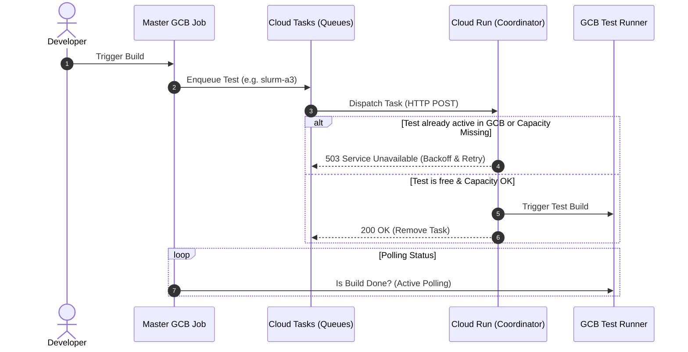
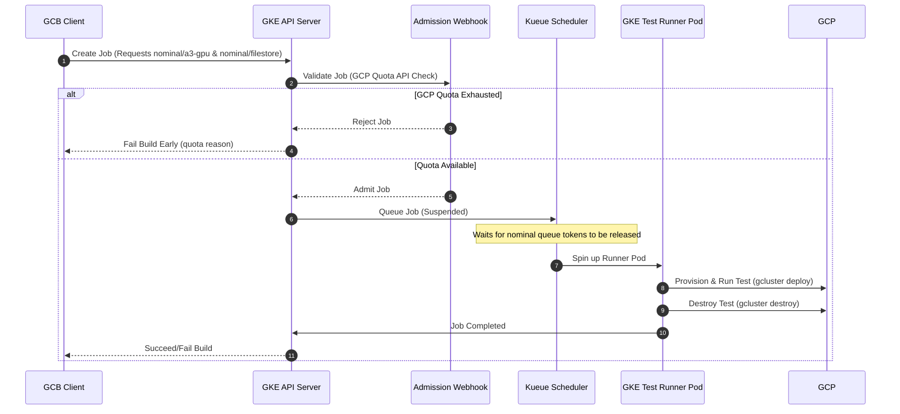
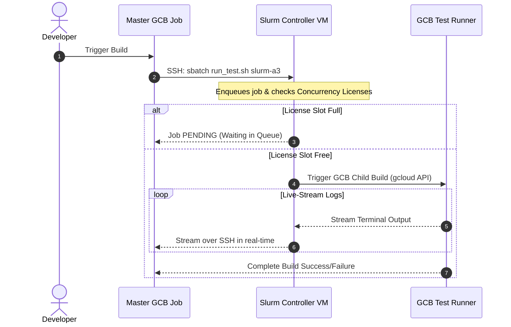

# Integration Testing: Concurrency Queueing & Scheduling Comparison Design Doc

## 1. Background & Problem Statement

### The Problem
Our current integration testing pipeline runs asynchronously directly in Google Cloud Build (GCB) without any coordination. This model creates severe bottlenecks:
* 💥 **Resource Contention & Quota Exhaustion:** Multiple tests run in parallel, competing for scarce regional GCP resources (A3 GPUs, TPUs, Filestore).
* 🛑 **Instant Failures on Capacity Errors:** Temporary capacity shortages (spot VM preemptions, zone capacity exhaustion) immediately crash the builds instead of queueing and retrying.
* ⚔️ **Test Collisions:** Concurrent runs of identical blueprints clash over identical hardcoded resource names (VPCs, subnets).

### Production Reality: Top 10 Causes of Instability (Last 30 Days as of May 25, 2026)
To ground our scheduling decisions in real-world data, we analyzed the empirical failure logs of our integration testing pipeline for the **last 30 days (as of May 25, 2026)**. Below are the classified top 10 causes of integration pipeline instability:

| Cause of Failure | Count of Incidents |
| :--- | :---: |
| **NO_ZONE_HAVE_ENOUGH_RESOURCES** | 59 |
| **NOT_ENOUGH_RESOURCES** | 59 |
| **STOCKOUT** | 42 |
| **Subnet_NOT_FOUND_IN_ZONE** | 37 |
| **GKE_NODEPOOL_ERROR** | 35 |
| **TEST_COLLISION** | 30 |
| **unknown_SLURM_COMPUTE_BOOT** | 28 |
| **unknown_NODE_FAILURE** | 28 |
| **unknown_SLURM_RESUME_TIMEOUT** | 25 |
| **CAPACITY_NOT_FOUND_IN_ZONE** | 24 |

> 💡 **Key Takeaway:** Nearly **70% of all pipeline failures (251 out of 367 incidents)** are directly caused by GCP resource limitations, spot stockouts, subnet allocation bottlenecks, and concurrent test collisions (with only GKE node pool and unknown Slurm/node failures being separate issues), mathematically proving that a resource-aware queueing and scheduling system is required to stabilize our builds.

### The Goal
To solve these failures—specifically resource exhaustions (142 total incidents), preemption stockouts (42), and concurrent collisions (30)—we are evaluating three queueing and scheduling designs:

1. **Design A: GCB Monitored External Queue** (Cloud Tasks + Cloud Run Coordinator)
   * *Description:* A fully serverless approach where a Master GCB job pushes integration tests as tasks to Cloud Tasks queues. A Cloud Run Coordinator acts as the gatekeeper, checking real-time GCP capacity and GCB execution states to trigger or queue the child test builds.
2. **Design B: Test Scheduling with GKE Kueue** (GKE + Kueue Scheduler)
   * *Description:* A Kubernetes-native approach that shifts test execution from GCB to Pods on a dedicated GKE cluster. It leverages the Kueue scheduler to enforce multi-dimensional virtual nominal resource limits (GPUs, storage) globally, using Workload Identity for secure, scoped GCP access.
3. **Design C: Hybrid Slurm + GCB Pipeline** (Slurm Workload Manager + Cloud Build)
   * *Description:* A hybrid approach that keeps the GCB testing ecosystem intact but replaces serverless or Kubernetes queueing middleware with an industry-standard Slurm Workload Manager cluster. Slurm manages queueing and concurrency natively via generic licenses, while a Master GCB job triggers builds and streams logs over secure SSH.

---

## 2. Comparison Matrix

| Architectural Dimension | Design A: GCB Monitored Queue 🔴 | Design B: GKE Kueue 🟢 | Design C: Hybrid Slurm + GCB 🔵 |
| :--- | :--- | :--- | :--- |
| **Primary Orchestrator** | GCB Master Job + Cloud Tasks + Cloud Run | GKE Cluster + Kueue Scheduler | GCB Master Job + Slurm Controller VM |
| **Where Test Code Runs** | GCB runner VMs | GKE Runner Pods via K8s Jobs | GCB runner VMs (triggered by Slurm) |
| **Queueing Engine** | Cloud Tasks (simple FIFO queues) | Kueue (Kubernetes-native scheduler) | Slurm Workload Manager |
| **Concurrency Control** | `max_concurrent_dispatches = 1` per queue | Dynamic Virtual Resource Tokens | Slurm Concurrency Licenses (native locks) |
| **Admission Control** | Cloud Run Coordinator checks GCB | Cloud Run Webhook checks GCP API | Slurm Scheduler (native queue checks) |
| **Security Model** | Broad GCB Service Account IAM roles | GKE Pods using Workload Identity | Secure SSH Keys + GCB Trigger IAM roles |
| **Leak Prevention** | **GCB `finally` + Serverless Daily Janitor.**  1. Active test runner VMs use native GCB `finally` blocks to run local destroy scripts. 2. As a fallback for crashed `finally` blocks, **Cloud Scheduler** launches a daily, serverless **GCB Cleanup Build** to scan, identify, and garbage-collect all orphaned resources older than 24 hours. | **Pod Graceful Stop + GKE CronJob.**  1. Active runner Pods receive `SIGTERM` and run local destroy scripts within K8s `terminationGracePeriodSeconds` during cancels. 2. As a fallback for Pod crashes/preemptions, a native **GKE `CronJob`** runs daily inside the GKE cluster, sweeping the GCP project APIs to clean up all orphaned resources older than 24 hours. | **GCB `finally` + Serverless Daily Janitor.**  1. Active child test runner builds triggered by Slurm use GCB `finally` blocks to run local destroy scripts. 2. As a fallback for VM or controller daemon crashes, **Cloud Scheduler** launches a daily, serverless **GCB Cleanup Build** to scan and garbage-collect all orphaned resources older than 24 hours, exactly as in Design A. |
| **Infrastructure Type** | Fully Serverless | Managed GKE Cluster | Dedicated Slurm Controller VM |
| **Operational Overhead**| Extremely Low | High (GKE Standard) / **Minimal (GKE Autopilot)** | Medium (Requires custom, production-grade deployment/management of a Slurm Controller VM) |
| **Adding/Removing Tests**| ❌ **Manual natively, but can be automated.** Requires provisioning new Cloud Tasks queues via IaC and updating Cloud Run mapping configs. Stale queues must be manually deleted unless fully automated via custom scripts. | **100% Dynamic.** If using existing resource pools, no config changes are needed. Removing a test automatically cleans up its footprint. | **Semi-Automatic.** Uses Slurm licenses. If using existing licenses, no changes are needed. New license types require a simple config change on the controller. |
| **Retry Mechanism** | **Orchestrator-Managed Logs Filtering.** If a test fails, the Master job reads the logs. If it identifies a **retryable error** (e.g., transient environment/capacity issues), it re-enqueues the task with a delay. **If it identifies a non-retryable error (e.g., code bug or test failure), the Master halts execution immediately to save resources.** | **K8s Job Suspension & Re-queueing.** GKE uses native pod failure policies to identify the error type. If a test fails with a **non-retryable error**, GKE fails the Job immediately. For **retryable errors**, GKE **natively suspends the Job (`spec.suspend: true`)**, which automatically releases resource tokens and places the Job back into the suspended Kueue queue to wait in line. | **Script-Managed Requeue Filter.** The Slurm wrapper script monitors execution. It parses the logs and **only triggers a requeue if it detects a retryable error**. If a **non-retryable error** is found, the script reports the failure immediately without putting the job back into the queue. |
| **Cancellation Flow** | **Master-Driven Purge & Abort.** If a PR is cancelled/updated, the GCB Master job triggers its native `finally` safety net block:  1. It calls the Cloud Tasks API to instantly delete and purge all pending/waiting tasks from the queues. 2. It calls the GCB API to abort any currently running test runner VMs. 3. Cancelled runner VMs instantly execute cleanup scripts to destroy all deployed resources. | **Native K8s Job Deletion & Eviction.** If a PR is cancelled/updated: 1. GCB sends a delete command to GKE, which instantly evicts any pending/suspended Jobs from the Kueue queue. 2. Active runner Pods receive a termination signal (`SIGTERM`) and are given a graceful shutdown window to run cleanup/destroy scripts and tear down the test resources before the Pod is destroyed. | **Slurm Controller Cancel (`scancel`).** If a PR is cancelled/updated: 1. The GCB Master job connects to the Slurm VM and runs `scancel` to abort the job. 2. Slurm instantly terminates the queue entry, releases the concurrency license, and aborts the active child GCB test build. |

---

## 3. Pros & Cons Summary Table

| Design Option | Key Pros (Advantages) | Key Cons (Risks/Drawbacks) |
| :--- | :--- | :--- |
| **Design A: GCB Monitored Queue** 🔴 *(Cloud Tasks + Cloud Run)* | • **Extremely Low Overhead:** Fully serverless ($0 idle cost). • **Zero Test Code Changes:** Logic resides entirely outside runner VMs. • **Collision Protection:** Restricts concurrency dynamically per queue. • **Serverless Leak Sweep:** Cleanups automated via Cloud Scheduler. | • **Double-Billing Idle Cost:** GCB Master sits active polling GCB. • **24-Hour GCB Timeout:** Backlogged runs can hit platform timeouts. • **Single Point of Failure (SPOF):** Entire queue halts if Cloud Run Coordinator crashes. • **At-Least-Once Duplicate Risk:** Cloud Tasks double-dispatches trigger duplicate parallel builds. • **Manual natively:** Adding tests requires new IaC queues and mapping updates. • **Bespoke Scheduler:** Re-inventing multi-resource scheduling. |
| **Design B: GKE Kueue** 🟢 *(Kubernetes-Native)* | • **Multi-Dimensional Scheduling:** Handles GPU + storage limits natively. • **100% Dynamic Discovery:** Tests request resources via Job spec. • **Autopilot Minimal Overhead:** No node upgrades, VM patching, or autoscaler tuning. • **Workload Identity Security:** Least privilege GSAs for Pods. • **FailedScaleUp Eviction:** Natively evicts/re-queues spot VMs on stockouts without custom webhook code. | • **High Ops Overhead on GKE Standard:** Upgrades/maintenance are heavy. • **Terraform State Lock Leaks:** Node preemption mid-execution leaves GCS state locked, requiring manual unlock. • **Autoscaler Latency:** Node provisioning adds 1-3 minutes delay. • **Debugging Complexity:** Logs scattered across GKE, GCB, and Cloud Logging. • **Double-Billing Idle Cost:** GCB client still waits/polls GKE. |
| **Design C: Hybrid Slurm + GCB** 🔵 *(Slurm + Cloud Build)* | • **HPC-Native Concurrency:** Uses native Slurm licenses. • **Spot VM Preemption Recovery:** Natively re-queues jobs on spot preemption (`scontrol requeue` up to 3x). • **Leverages Domain Skills:** Uses team's existing Slurm IaC expertise. • **GCB Dashboard History:** Runs tests as child GCB builds. • **Serverless Leak Sweep:** Cleanups automated via Cloud Scheduler. | • **Fixed Idle Compute Cost:** Dedicated Controller VM runs 24/7. • **Single Point of Failure (SPOF):** Entire pipeline blocks if Slurm VM/daemon crashes. • **Medium Ops Overhead:** Custom production VM (not simple IaC templates) requires patching and configuration. • **Double-Billing Idle Cost:** GCB Master sits active polling over SSH. • **Fragile SSH Dependency:** Relies on OS Login/firewall VPC routes. |

---

## 4. Design A: GCB Monitored External Queue

### Architectural Overview
Design A establishes a serverless queueing system outside the test execution environment. A **Master GCB Job** acts as the central controller. When triggered, it pushes tests as tasks to **Cloud Tasks** queues. Cloud Tasks dispatches these tasks to a **Cloud Run Coordinator** (gatekeeper). 

The Coordinator checks if the same blueprint is already active in GCB or if zone capacity is missing. If busy, it returns an HTTP `503 Service Unavailable` to Cloud Tasks, triggering an exponential backoff retry. If free, it triggers the test build in GCB and returns an HTTP `200 OK`, removing the task from the queue. The Master GCB Job then enters an active polling loop to track the triggered test runs.

### Sweet Spot (Where it is Best)
* **Ideal for:** Small to medium engineering teams with limited Kubernetes or HPC expertise, tight operational budgets, and relatively simple resource requirements where tests rarely share overlapping global storage quotas (like Filestore) or complex multi-dimensional limits.

### Detailed Pros
* **Zero Changes to Existing Tests:** The entire scheduling, queueing, and failure retry logic resides completely outside the test VM environments. Test deployment scripts (`gcluster deploy`, Terraform, Ansible) remain untouched.
* **Serverless and Low Cost:** Cloud Tasks and Cloud Run operate on a pay-as-you-go serverless model. When there are no tests running, the infrastructure costs literally $0.
* **Name Collision Protection:** Keeping the queue concurrency at `1` guarantees that the exact same blueprint never runs twice in parallel, eliminating Terraform lock contentions and static resource clashes.
* **Serverless Leak Sweep:** Preemption resource leaks can be fully cleaned up by introducing a serverless **daily GCB cleanup build triggered by Cloud Scheduler**, eliminating GKE requirements.

### Detailed Cons & Failure Modes
* **The Double-Billing Idle Polling Cost:** The Master GCB job must remain active, spinning and polling GCB for the entire duration of all triggered builds. For long-running tests, this translates to significant wasted GCB active build minutes.
* **GCB 24-Hour Platform Limit:** GCB has a hard execution ceiling of 24 hours. If multiple long-running tests are queued sequentially, the Master GCB job will easily exceed the 24-hour timeout and crash, failing the entire PR build.
* **Single Point of Failure (SPOF):** The Cloud Run Coordinator is a single point of failure. If it crashes, experiences a cold start timeout, or fails due to GCB API rate limits, the entire integration testing queue is broken.
* **At-Least-Once Delivery Double-Triggering:** Cloud Tasks is an "at-least-once" delivery system. If the Coordinator triggers GCB but crashes or times out before returning `200 OK` to Cloud Tasks, Cloud Tasks will retry the dispatch. This will trigger a **duplicate GCB test build**, immediately causing Terraform state lock errors and resource clashes, completely breaking the concurrency-of-1 guarantee.
* **Bespoke Scheduler Anti-Pattern:** A FIFO queue (Cloud Tasks) is not a scheduler. Attempting to manage complex, multi-dimensional resource constraints (e.g., aligning GPU quotas with Filestore limits) in the Cloud Run Coordinator will force the team to write a custom, state-tracking database and scheduling engine, reinventing a fragile, buggy version of Kubernetes Kueue.
* **Manual natively, but can be automated:** Adding new test blueprints requires creating new Cloud Tasks queues via IaC, and updating the Coordinator's test-to-trigger mapping database. Stale, deprecated queues must be manually deleted to prevent GCP resource bloat.
* **GCB API Rate Limiting:** The Master GCB job and the Coordinator will make frequent calls to the GCB API to trigger builds and check status, risking `429 Too Many Requests` errors under heavy PR loads.
* **Bypassing the Queue:** Developers can still trigger GCB builds manually via the GCP Console or `gcloud` CLI, completely bypassing the Cloud Tasks queue and leading to silent quota exhaustion that fails queued builds without warning.

---

## 5. GKE Kueue Architecture

### Architectural Overview
Design B shifts test execution to a dedicated **GKE Cluster** operated by the engineering team. GCB's role is reduced to a client that submits a Kubernetes `Job` manifest to GKE. GKE runs **Kueue**, a Kubernetes-native job queueing controller.

Jobs specify the **Virtual Nominal Resources** they require (e.g., `nominal/a3-gpu: 1`, `nominal/filestore: 1`). If any requested token limit is currently exhausted, Kueue suspends the Job in the queue. Before a Job is admitted, a **Dynamic Admission Webhook** (Cloud Run) checks real-time GCP regional quotas via API. If the quota is exhausted, the webhook rejects the Job creation request, failing the GCB build immediately with a clear error log. Once admitted, a **Test Runner Pod** is spun up on GKE. This Pod clones the workspace, runs `gcluster deploy` (Terraform), executes validation (Ansible), and tears the infrastructure down via `gcluster destroy`.

### Sweet Spot (Where it is Best)
* **Ideal for:** Large-scale, multi-project, resource-intensive pipelines requiring advanced multi-dimensional quotas (e.g., managing GPU, TPU, NetApp, and Filestore quotas across overlapping tests), and highly secure corporate environments with dedicated infrastructure platform teams.

### Detailed Pros
* **Multi-Dimensional Resource Scheduling:** Kueue resolves complex, multi-resource limits natively. If a test needs both an `A3 GPU` and a `Filestore` instance, Kueue blocks the job if *either* limit is reached, serializing competing tests while allowing non-competing tests to bypass and run immediately.
* **Granular Least-Privilege Security (Workload Identity):** Using GKE Workload Identity, the Kubernetes Service Account (KSA) of the Test Runner Pod is dynamically bound to a Google Service Account (GSA) with narrow permissions scoped strictly to the specific test project. The GCB Service Account no longer needs admin access to test environments.
* **Daily Orphaned Resource Garbage Collection:** A GKE `CronJob` runs daily as a safety net. It sweeps the GCP test projects using direct API calls and Cloud Asset Inventory, cross-referencing resources with active GKE jobs and GCB builds, and cleans up any leaked infrastructure older than 24 hours.
* **Native Queue Expiry & Prioritization:** Respects `activeDeadlineSeconds` to auto-terminate stale queued jobs, and natively supports K8s `PriorityClasses` to let hotfixes preempt lower-priority jobs.
* **Autoscaler-Driven FailedScaleUp Eviction:** GKE Kueue natively integrates with Cluster Autoscaler. If a pod fails to schedule due to a Spot VM stockout, K8s registers a `FailedScaleUp` event, and Kueue natively evicts/re-queues the suspended Job, eliminating the need for any custom admission webhook.
* **Minimal Overhead on GKE Autopilot:** Google fully manages control plane upgrades, OS security patching, and node pool autoscaling, reducing operational maintenance to near-zero.

### Detailed Cons & Failure Modes
* **High Operational Overhead (If GKE Standard):** Managing cluster upgrades, node pool configurations, networking routes, and etcd state backups introduces significant administrative burden for the infrastructure team. **(Fully mitigated to Minimal if using GKE Autopilot).**
* **Dynamic Webhook Quota Race Conditions:** The admission webhook's 1-2s cache window allows parallel tasks triggered simultaneously to slip through with the same cached quota data, causing resource provisioning failures during the Terraform deploy phase.
* **Terraform State Lock Leaks on Preemption:** GKE nodes running Test Runner Pods can be preempted by Google at any time. If killed abruptly, the GCS Terraform state lock is left locked. All subsequent runs for that blueprint will fail with state lock errors, requiring manual administrative intervention.
* **GCB Polling Cost:** GCB runner still remains active, waiting/polling GKE (unless a complex Pub/Sub callback is implemented), keeping some of the double-billing overhead alive.
* **GKE Node Autoscaler Latency:** GKE autoscaling takes 1-3 minutes to provision new nodes when tests are ready to run, adding extra wait time to every test suite execution.
* **Highly Complex Debuggability Flow:** Logs are scattered across GCB console, GKE pod stdout, and Cloud Logging, requiring a unified Trace ID to debug failures effectively.

---

## 6. Design C: Hybrid Slurm + GCB Pipeline

### Architectural Overview
Design C introduces **Slurm Workload Manager** to act as the central scheduling and queueing plane while preserving the GCB ecosystem for test execution. The **Master GCB Job** acts as the CI orchestrator. When triggered, it connects to a dedicated **Slurm Controller VM** via secure SSH and submits the test runs as Slurm jobs (`sbatch`).

We configure **Slurm Concurrency Licenses** (e.g., `Licenses=poc-test-infra-master-trigger:1`) inside Slurm's config. Slurm holds the jobs in a `PENDING` state (Reason: `Licenses`) if a build for that blueprint is already running. When the license slot is free, Slurm dispatches the job. The Slurm runner script (`run_test_slurm.sh`) then triggers the **pre-existing GCB test trigger** by name, captures the child build ID, and **live-streams the child GCB build logs in real-time** back to the Master GCB Job console over SSH.

### Sweet Spot (Where it is Best)
* **Ideal for:** HPC-focused engineering teams already building and maintaining Slurm clusters. It leverages the team's native expertise in Slurm to completely avoid K8s operational overhead while providing robust, cluster-wide queueing and preemption recovery.

### Detailed Pros
* **Industry-Standard Queueing & Concurrency:** Natively prevents naming collisions and Terraform state lock issues using Slurm's highly mature licensing and scheduling limits (no custom middleware code required).
* **HPC-Native Resource Preemption Recovery:** If a test fails due to GCP Spot VM preemption, the Slurm runner catches the custom exit code and automatically calls `scontrol requeue` to gracefully place the job back into the queue (up to 3 times).
* **Preserves GCB Console & Log History:** Since Slurm triggers actual GCB triggers, engineers retain the full Cloud Build dashboard, history, and security integrations.
* **Semi-Automatic Test Discovery:** Uses Slurm licenses. Adding/removing tests with existing limits is 100% automatic. New resource classes require a simple config change on the controller.
* **Serverless Leak Sweep:** Preemption resource leaks can be fully cleaned up by introducing a serverless **daily GCB cleanup build triggered by Cloud Scheduler**, eliminating the need for GCB `finally` blocks to be 100% reliable.

### Detailed Cons & Failure Modes
* **Non-Serverless Controller VM (Fixed Cost & Maintenance):** The Slurm Controller VM must stay online 24/7 to act as the persistent scheduler. Because this is a custom, production-grade VM deployment (and not a quick, native toolkit template), the controller represents a fixed, non-zero monthly compute cost and requires active operational maintenance (OS patching, Slurm config tuning, SSH security audits).
* **Single Point of Failure (SPOF):** If the Slurm Controller VM goes offline, the `slurmctld` daemon crashes, or its OS Login authentication breaks, the entire integration testing pipeline is completely blocked.
* **GCB Double-Billing & Polling (Same as Design A):** The GCB Master Job must remain active and connected via SSH to stream logs for the duration of the test run, consuming active GCB build minutes.
* **SSH and Networking Dependency:** Extremely fragile. The Master GCB job relies on secure SSH keys (OS Login) and direct network access to the Slurm Controller VM. A minor SSH key rotation issue, OS Login sync failure, or VPC-SC firewall change will instantly block the entire pipeline.
* **NFS Mount Vulnerability:** The job wrapper script must be synced to the Slurm controller's shared directory. If the NFS mount goes down or the script gets corrupted, all test runs will fail instantly.

---

## 7. Side-by-Side Feature Comparison

| Feature | Design A: GCB Queue 🔴 | Design B: GKE Kueue 🟢 | Design C: Hybrid Slurm + GCB 🔵 |
| :--- | :--- | :--- | :--- |
| **Orchestration Model** | Serverless Cloud Tasks | Managed Kubernetes | Hybrid Slurm Controller VM |
| **Where Test Code Runs** | GCB runner VMs | GKE Runner Pods via K8s Jobs | GCB runner VMs (triggered by Slurm) |
| **Queueing Engine** | Cloud Tasks (simple FIFO queues) | Kueue (Kubernetes-native scheduler) | Slurm Workload Manager |
| **Concurrency Control** | `max_concurrent_dispatches = 1` per queue | Dynamic Virtual Resource Tokens | Slurm Concurrency Licenses (native locks) |
| **Admission Control** | Cloud Run Coordinator checks GCB | Cloud Run Webhook checks GCP API | Slurm Scheduler (native queue checks) |
| **Security Model** | Broad GCB Service Account IAM roles | GKE Pods using Workload Identity | Secure SSH Keys + GCB Trigger IAM roles |
| **Leak Prevention** | GCB `finally` block + Daily Cloud Scheduler GCB Cleanup Build | Daily GKE `CronJob` Orphan Collector | GCB `finally` block + Daily Cloud Scheduler GCB Cleanup Build |
| **Infrastructure Type** | Fully Serverless | Managed GKE Cluster | Dedicated Slurm Controller VM |
| **Operational Overhead**| Extremely Low | High (GKE Standard) / **Minimal (GKE Autopilot)** | Medium (Requires custom, production-grade deployment/management of a Slurm Controller VM) |
| **Adding/Removing Tests**| ❌ **Manual natively, but can be automated.** Requires provisioning new Cloud Tasks queues via IaC and updating Cloud Run mapping configs. Stale queues must be manually deleted unless fully automated via custom scripts. | **100% Dynamic.** If using existing resource pools, no config changes are needed. Removing a test automatically cleans up its footprint. | **Semi-Automatic.** Uses Slurm licenses. If using existing licenses, no changes are needed. New license types require a simple config change on the controller. |

---

## 8. Solving the Open Questions of Design A using the Alternatives

### 1. Machine-Specific vs. Test-Specific Queues?
* **Design B (Kueue):** Solved using **Virtual Nominal Resources**. Quota is enforced globally by tokens (e.g. `nominal/a3-gpu = 4`).
* **Design C (Slurm):** Solved using **Slurm Licenses** (e.g., `Licenses=slurm-a3:1`). Every blueprint requests a license. Slurm locks access to the license globally, preventing name collisions while allowing non-competing builds to run in parallel.

### 2. Manual Prioritization (Hotfixes / RCs)?
* **Design B (Kueue):** Solved natively using K8s `PriorityClasses` and preemption.
* **Design C (Slurm):** Solved natively using `scontrol update jobid=X priority=Y`. High priority jobs are placed at the top of the queue automatically.

### 3. Cancellation Flows and Queue Bloating?
* **Design B (Kueue):** Solved natively via `kubectl delete job`, which sends `SIGTERM` to the runner Pod to run a graceful `gcluster destroy` within K8s `terminationGracePeriodSeconds`.
* **Design C (Slurm):** Solved natively via SSH `scancel <job_id>`. GCB's `finally` block simply connects to Slurm and cancels the job. Slurm stops the GCB child build and frees up the license.

### 4. Starvation & Cross-Queue Communication?
* **Design B (Kueue):** Solved natively using Kueue's **Cohorts** and **Fair Sharing** algorithms.
* **Design C (Slurm):** Solved natively using Slurm's **Multi-Factor Association Priority** and **Backfill Scheduling** algorithms.

### 5. Local Triggering?
* **Design B (Kueue) & Design C (Slurm):** Local workstation runs bypass GKE/Slurm queues entirely and communicate directly with GCP Compute APIs, exactly as they do today.

---

## 9. Complete Architectural Teardown: Inherent Problems & Risks

### Design A: Cloud Tasks + Cloud Run Coordinator

#### Inherent Design Flaws (Why it will fail at scale)
* **The 24-Hour Master GCB Timeout:** The Master GCB build must stay alive, polling. If there is a long backlog of tests, the Master GCB build will hit GCB’s 24-hour platform timeout limit, aborting the entire build run and leaving developers without test results.
* **At-Least-Once Delivery Double-Triggering:** Cloud Tasks guarantees delivery, meaning it occasionally dispatches a task *twice*. If the Cloud Run Coordinator triggers GCB but crashes or times out before returning `200 OK` to Cloud Tasks, Cloud Tasks will retry the dispatch. This will trigger a **duplicate GCB test build**, immediately causing Terraform state lock errors and resource clashes, completely breaking the concurrency-of-1 guarantee.
* **GCB API Rate Limiting:** The Master GCB job and the Coordinator will make frequent calls to the GCB API to trigger builds and check status. The GCB API has strict, low rate limits. Under heavy PR loads, the pipeline will fail with `429 Too Many Requests` errors.
* **Bypassing the Queue:** Developers can still trigger GCB builds manually via the GCP Console or `gcloud` CLI. This completely bypasses the Cloud Tasks queue, leading to silent quota exhaustion that fails queued builds without warning.
* **Resource Leak Mitigation (Serverless Alternative):** To mitigate the risk of GCB `finally` block failures, we do **not** need a GKE cluster to run a daily cleanup CronJob. We can implement a **fully serverless daily Orphan Collector** using a **Cloud Scheduler trigger that launches a daily GCB cleanup build**. This cron build will scan all target GCP test projects, check naming/tags, cross-reference active GCB runs, and safely delete orphaned resources older than 24 hours for a fraction of a cent.

---

### Design B: GKE Kueue Architecture

#### Inherent Design Flaws (Why it will fail at scale)
* **Dynamic Webhook Race Conditions:** The webhook's 1-2s cache to avoid hitting strict GCP Quota API rate limits is a fatal design flaw. If a developer pushes a commit that triggers 10 tests simultaneously, they will all hit the webhook within milliseconds. The webhook will read the same cached quota data, approve all 10 jobs, and Kueue will schedule them. The tests will then crash during the `gcluster deploy` phase because the physical GCP quota is exceeded.
* **Terraform State Lock Leaks on Pod Crash:** If a GKE node is preempted or the Test Runner Pod crashes mid-execution, the Terraform state lock in the GCS bucket will remain locked. All subsequent runs for that blueprint will fail with `Terraform State Locked` errors, requiring manual administrative intervention to force-unlock the state.
* **GKE Node Autoscaler Latency:** When Kueue admits a job, the GKE cluster autoscaler takes 1 to 3 minutes to spin up a new node. This autoscaling delay adds latency to every single test suite run, frustrating developers.
* **Kubernetes and GKE Upgrade Overhead:** GKE requires regular upgrades (typically every 3-4 months). Upgrading the control plane or node pools can introduce breaking changes to Kueue CRDs, RBAC policies, or Workload Identity behaviors, causing sudden, project-wide pipeline outages.

---

### Design C: Hybrid Slurm + GCB Pipeline
* **GCB Double-Billing and Polling:** Just like Design A, the GCB Master Job has to sit active for the entire duration of the tests to stream logs from Slurm, costing GCB active build minutes and risking a 24-hour GCB timeout.
* **VM Maintenance & Fixed Costs:** You must keep the Slurm Controller VM running 24/7. While the compute nodes autoscaling works, the controller itself represents a fixed, non-serverless monthly compute cost and needs maintenance (OS patching, Slurm config tuning).
* **SSH Authentication & IAM:** Granting the GCB service account permissions to SSH into the Slurm Controller dynamically requires complex IAM bindings (`Instance Admin v1`, `Service Account User`) and OS Login setup, which can easily break due to corporate IAM policies or VPC-SC perimeters.
* **NFS Mount Vulnerability:** The job wrapper script must be synced to the Slurm controller's shared directory. If the NFS mount goes down or the script gets corrupted, all test runs will fail instantly.
* **Resource Leak Mitigation (Serverless Alternative):** Just like Design A, we can completely mitigate preemption and crash resource leaks in Design C by introducing a **daily GCB Cleanup build triggered by Cloud Scheduler**. This eliminates the need for standard GCB `finally` blocks to be 100% reliable, providing the exact same robust garbage collection as Design B without the operational weight of GKE.

---

## 10. Long-Term Scalability & Regression Protection (Adding/Removing Tests)

As the engineering codebase expands, test suites will inevitably grow. It is vital that adding or removing tests requires minimal manual overhead and has zero risk of introducing queueing regressions.

### Design A (Cloud Tasks): Manual and Fragile
* **How it works:** To add a new test blueprint, a developer must manually provision a new Cloud Tasks queue using Terraform, define `max_concurrent_dispatches = 1`, and add environment variable mappings to the Cloud Run Coordinator.
* **Regression Risk:** High. If a developer adds a test file but forgets to write the Terraform config to create the queue:
  1. The Master job will fail to enqueue the task, causing the entire PR build to crash.
  2. If they bypass the queue entirely, the test runs concurrently and uncoordinated, silently exhausting quotas and crashing other developer builds.
  3. When removing a test, the old Cloud Tasks queue must be manually destroyed via Terraform to prevent resource/infrastructure sprawl.

### Design B (GKE Kueue): Dynamic and Automatic
* **How it works:** Kueue jobs are native K8s objects. The GCB client dynamically submits K8s Job specs. If a new test blueprint uses existing virtual nominal resources (e.g. A3 GPU or TPU v5), **no queue config changes are required.** The GKE Kueue cluster automatically schedules the new test.
* **Regression Risk:** Extremely Low. Tests declare their own resource requests. Adding a test is transparent to the scheduler. Removing a test is as simple as deleting the test trigger; no stale, orphan queueing infrastructure is left behind in the cluster. If a new, unconfigured resource token is requested, GKE natively suspends or rejects the job immediately, alerting the developer.

### Design C (Hybrid Slurm): Semi-Automatic
* **How it works:** Slurm jobs request concurrency licenses. If a new test uses existing licenses (e.g. `poc-test-infra-master-trigger`), it is **100% automatic** and requires zero config changes.
* **Regression Risk:** Low-to-Medium. If a new blueprint requires a new type of hardware limit that is not yet configured, a developer must edit the central `/etc/slurm/slurm.conf` file on the Controller VM, add the new license limit, and run `scontrol reconfigure`. While this requires manual controller configuration, Slurm safely rejects job submissions for unconfigured licenses, making the error highly visible rather than causing silent regressions.

---

## 11. Final Strategic Recommendation

1. **Short-Term / Simple Pipelines:** If you have fewer than 10-15 blueprints, minimal shared global resource limits, and your team has no dedicated Kubernetes platform engineers, **Design A (Cloud Tasks)** is the most practical starting point. It minimizes upfront engineering costs and can be deployed in days.
2. **Long-Term / Enterprise Scale:** If you are running a highly concurrent, enterprise-scale testing environment with hundreds of blueprints, complex cross-resource constraints, and strict security controls, **Design B (GKE Kueue)** is the only viable choice. 

*To mitigate Design B's high operational overhead, the team should deploy this exclusively on **GKE Autopilot** (which removes node pool management, OS patching, and cluster scaling duties) and implement a **Pub/Sub event-driven callback** fast-follow to eliminate GCB polling costs.*
