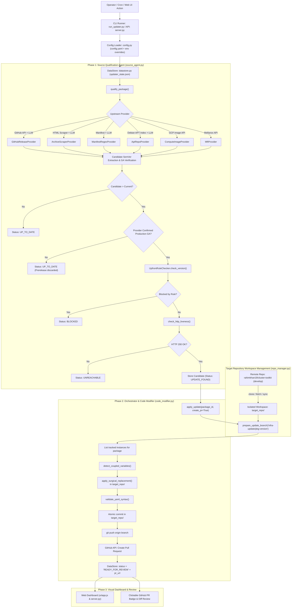
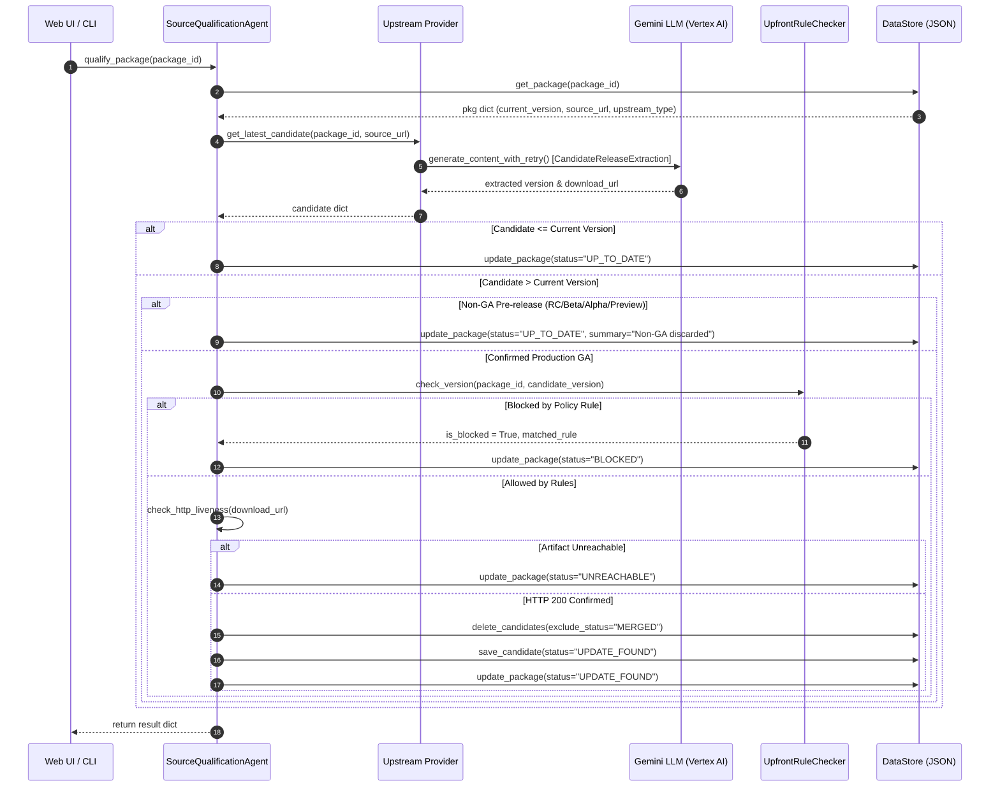
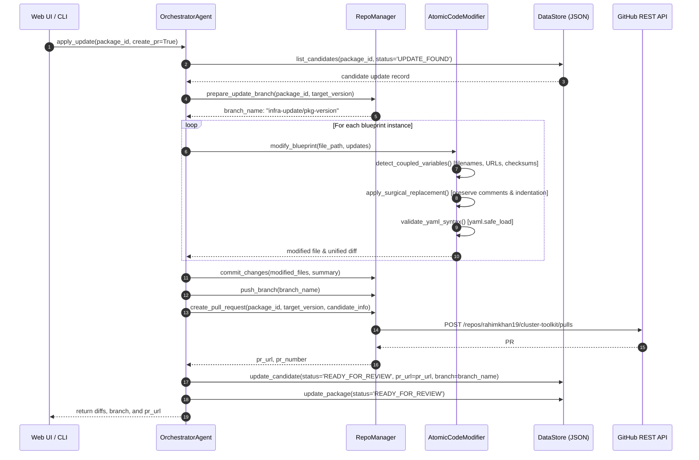

# Cluster Toolkit Automated Dependency Management Pipeline: End-to-End Architecture & Method Reference

**Document Version:** 2.0 (Decoupled Target Repository Architecture & Configuration-Driven PR Pipeline)  
**Location in Repository:** [`tools/infra_updater/`](file:///usr/local/google/home/rahimkh/Desktop/Projects/cluster-toolkit/tools/infra_updater)  
**Target Repository:** [`https://github.com/rahimkhan19/cluster-toolkit.git`](https://github.com/rahimkhan19/cluster-toolkit.git) (Branch: `develop`)  
**Primary Configuration:** [`tools/infra_updater/config.yaml`](file:///usr/local/google/home/rahimkh/Desktop/Projects/cluster-toolkit/tools/infra_updater/config.yaml)  
**Primary Datastore:** [`tools/infra_updater/updater_state.json`](file:///usr/local/google/home/rahimkh/Desktop/Projects/cluster-toolkit/tools/infra_updater/updater_state.json)

---

## 1. High-Level Architecture Overview

The Cluster Toolkit Automated Infrastructure Updater is a hybrid **deterministic + LLM agentic pipeline** designed to detect upstream releases, filter out unstable builds, enforce multi-blueprint policy rules, evaluate OS/kernel compatibility, and surgically apply atomic updates to infrastructure blueprints without corrupting comments or YAML formatting.

### Decoupled Target Repository Architecture
The updater is **completely decoupled** from the Cluster Toolkit code it modifies:
1. It targets remote repository: `https://github.com/rahimkhan19/cluster-toolkit.git` on branch `develop`.
2. It clones and maintains an isolated workspace directory (`tools/infra_updater/target_repo/`, ignored in `.gitignore`).
3. It fetches latest upstream changes, switches to an isolated update branch (`infra-update/{package_id}-{target_version}`), modifies target blueprint YAML files in the workspace, commits the changes with bot credentials, pushes the branch to remote, and creates a GitHub Pull Request via the GitHub REST API.
4. All pipeline parameters (repository URL, base branch, LLM models, provider timeouts, server ports, and tokens) are centralized in `config.yaml` / `config.py` with zero hardcoding in business logic.



---

## 2. Directory Layout & Core Files

| File | Purpose |
| :--- | :--- |
| [`config.yaml`](file:///usr/local/google/home/rahimkh/Desktop/Projects/cluster-toolkit/tools/infra_updater/config.yaml) | Streamlined configuration file containing only mandatory parameters: target repository URL, branch, Gemini LLM model, and dashboard server port. |
| [`config.py`](file:///usr/local/google/home/rahimkh/Desktop/Projects/cluster-toolkit/tools/infra_updater/config.py) | Type-safe configuration loader importing environment variables from `.env`, parameters from `config.yaml`, and exposing them cleanly. |
| [`repo_manager.py`](file:///usr/local/google/home/rahimkh/Desktop/Projects/cluster-toolkit/tools/infra_updater/repo_manager.py) | Standalone Git and GitHub API manager: clones/syncs `target_repo/`, creates update branches, commits changes, pushes to remote, and creates rich GitHub PRs. |
| [`datastore.py`](file:///usr/local/google/home/rahimkh/Desktop/Projects/cluster-toolkit/tools/infra_updater/datastore.py) | Thread-safe, atomic transactional JSON datastore managing live package states, candidates, learned rules, and audit logs. |
| [`init_db.py`](file:///usr/local/google/home/rahimkh/Desktop/Projects/cluster-toolkit/tools/infra_updater/init_db.py) | Initializes and seeds [`updater_state.json`](file:///usr/local/google/home/rahimkh/Desktop/Projects/cluster-toolkit/tools/infra_updater/updater_state.json) from canonical package registries and blueprint instances. |
| [`source_agent.py`](file:///usr/local/google/home/rahimkh/Desktop/Projects/cluster-toolkit/tools/infra_updater/source_agent.py) | Source Qualification Agent: Upstream release discovery, GA stability reasoning, upfront policy rule gatekeeping, and artifact liveness checks. |
| [`prompts/`](file:///usr/local/google/home/rahimkh/Desktop/Projects/cluster-toolkit/tools/infra_updater/prompts) | Central prompt package importing externalized LLM prompt templates (`compute_image.txt`, `apt_repo.txt`, `docker_hub.txt`, etc.). |
| [`code_modifier.py`](file:///usr/local/google/home/rahimkh/Desktop/Projects/cluster-toolkit/tools/infra_updater/code_modifier.py) | Atomic Code Modifier: Surgical comment-preserving YAML modification in `target_repo/`, coupled variable synchronization, signature keyword safety, AST validation, git commits, and PR triggering. |
| [`run_updater.py`](file:///usr/local/google/home/rahimkh/Desktop/Projects/cluster-toolkit/tools/infra_updater/run_updater.py) | Master CLI runner with rich colored terminal outputs supporting `--sync-repo`, `--check-all`, `--apply`, `--show-config`, `--test-rule-blocking`, `--test-llm-triage`, `--reset`, `--end-to-end`. |
| [`server.py`](file:///usr/local/google/home/rahimkh/Desktop/Projects/cluster-toolkit/tools/infra_updater/server.py) | Python HTTP server hosting the REST API (`/api/state`, `/api/logs`, `/api/diff`, `/api/action`) and serving the visual dashboard. |
| [`ui/app.js`](file:///usr/local/google/home/rahimkh/Desktop/Projects/cluster-toolkit/tools/infra_updater/ui/app.js) | Frontend single-page application handling target repo badges, PR links, candidate cards, diff review, and blueprint modals. |

---

## 3. End-to-End Flow & Method Directory

### Flow Step 0: Configuration & Target Workspace Synchronization

**Files:** [`config.py`](file:///usr/local/google/home/rahimkh/Desktop/Projects/cluster-toolkit/tools/infra_updater/config.py), [`repo_manager.py`](file:///usr/local/google/home/rahimkh/Desktop/Projects/cluster-toolkit/tools/infra_updater/repo_manager.py)

#### 1. `get_config() -> UpdaterConfig`
- **Purpose:** Loads `config.yaml`, checks for environment variable overrides (`GITHUB_TOKEN`, `GH_TOKEN`, `GEMINI_MODEL`, `UPDATER_TARGET_REPO`, `UPDATER_BASE_BRANCH`), discovers GitHub tokens from environment/container processes, and returns a validated `UpdaterConfig` object.

#### 2. `RepoManager.ensure_workspace(force_clean: bool = False) -> str`
- **When Called:** On initialization, before updates (`--sync-repo`), or during pipeline run Stage 0.
- **What It Does:**
  1. Checks if `target_repo/.git` exists. If not, performs `git clone --branch develop <repo_url> <workspace_dir>`.
  2. If already cloned, runs `git fetch origin develop`.
  3. If `force_clean=True`, runs `git checkout -f develop` and `git reset --hard origin/develop` to guarantee clean state.

#### 3. `RepoManager.prepare_update_branch(package_id: str, target_version: str) -> str`
- **Purpose:** Generates a deterministic branch name `infra-update/{package_id}-{target_version}` and creates it off latest `origin/develop`.

#### 4. `RepoManager.commit_changes(package_id, target_version, summary, modified_files) -> Tuple[bool, str]`
- **Purpose:** Configures git user (`author_name` and `author_email` from config), stages modified blueprint files, and creates an atomic commit with descriptive message.

#### 5. `RepoManager.push_branch(branch_name: str) -> bool`
- **Purpose:** Pushes the update branch to `origin` using the authenticated token URL.

#### 6. `RepoManager.create_pull_request(package_id, target_version, candidate_info, modified_blueprints) -> Dict[str, Any]`
- **Purpose:** Calls GitHub REST API `POST /repos/{owner}/{repo}/pulls`.
- **Payload Details:**
  - Title: `[Infra Update] Upgrade {package_id} to {target_version}`
  - Head: `infra-update/{package_id}-{target_version}`
  - Base: `develop`
  - Body: Formatted GitHub Markdown containing:
    - Compatibility verdict badge (`COMPATIBLE`, `POTENTIALLY_BREAKING`)
    - Executive summary from Gemini LLM
    - Breaking changes callout
    - Table of affected blueprint files and synchronized coupled variables
    - Testing instructions

---

### Flow Step 1: Upstream Discovery & Candidate Qualification

**File:** [`source_agent.py`](file:///usr/local/google/home/rahimkh/Desktop/Projects/cluster-toolkit/tools/infra_updater/source_agent.py)  
**Entry Point:** `SourceQualificationAgent.qualify_package(package_id)` or `SourceQualificationAgent.qualify_all()`



#### Detailed Method Breakdown in `source_agent.py`:

#### 1. `clean_error_message(ex: Any) -> str`
- Sanitizes raw Python exceptions, Google RPC tracebacks, protobuf message sets, or Vertex AI error JSON dumps into a concise, human-readable 1-line summary.

#### 2. `generate_content_with_retry(client, model, contents, config, max_retries, initial_delay) -> Any`
- Wraps `client.models.generate_content` with exponential backoff loaded from `config.yaml`.

#### 3. `check_http_liveness(url: str) -> bool`
- Deterministic verification gate before calling LLM. Checks that download artifacts exist and return HTTP 200.

#### 4. Upstream Provider Methods:
- **`GitHubReleaseProvider`**: Queries GitHub API `/repos/{owner}/{repo}/releases` and extracts latest production GA version and assets.
- **`ArchiveScraperProvider`**: Scrapes official NVIDIA release archive pages and filters GA standalone `.run` installers for target architecture.
- **`ManifestRegexProvider`**: Fetches Kubernetes/container manifests and extracts container image tags.
- **`ComputeImageProvider`**: Dynamically describes GCP compute images from project/family via `gcloud` and prompts Gemini using `compute_image.txt`.
- **`AptRepoProvider`**: Dynamically downloads Debian/Ubuntu `Packages.gz` and extracts package stanzas using `apt_repo.txt`.
- **`MftProvider`**: Scrapes Mellanox firmware archive directories for latest GA `.tgz` binaries.
- **`DockerHubProvider`**: Scrapes Docker Hub tags API for latest production GA container images using `docker_hub.txt`.

---

### Flow Step 2: Atomic Code Modification & Pull Request Creation

**File:** [`code_modifier.py`](file:///usr/local/google/home/rahimkh/Desktop/Projects/cluster-toolkit/tools/infra_updater/code_modifier.py)  
**Entry Point:** `OrchestratorAgent.apply_update(package_id, create_pr=True)`



#### Detailed Method Breakdown in `code_modifier.py`:

#### 1. `AtomicCodeModifier._replace_variable_in_text(content, var_name, new_val) -> Tuple[str, bool, str]`
- Replaces variables while strictly preserving comments, multiline formatting, and indentations.

#### 2. `OrchestratorAgent.apply_update(package_id: str, create_pr: bool = True) -> Dict[str, Any]`
- Coordinates:
  1. Target workspace branch creation (`infra-update/{package_id}-{target_version}`).
  2. Modifying YAML files in `target_repo/`.
  3. Validating syntax with `yaml.safe_load`.
  4. Atomic git commit.
  5. Pushing branch to remote.
  6. Opening GitHub Pull Request.
  7. Updating DataStore status to `READY_FOR_REVIEW` with `pr_url` and `branch`.

#### 3. `OrchestratorAgent.revert_update(package_id: Optional[str] = None) -> Dict[str, Any]`
- Calls `repo_manager.ensure_workspace(force_clean=True)` to cleanly reset `target_repo/` to `origin/develop`.

---

### Flow Step 3: Web Server & Real-Time Dashboard API

**File:** [`server.py`](file:///usr/local/google/home/rahimkh/Desktop/Projects/cluster-toolkit/tools/infra_updater/server.py)

- **Endpoints:**
  - `GET /api/state`: Returns package registries, blueprint instances, active candidates, learned rules, audit runs, git diff statistics, and active config details (`repo_url`, `owner`, `repo_name`, `base_branch`, `llm_model`, `token_present`).
  - `GET /api/logs`: Streams execution logs from `LogStreamBuffer`.
  - `GET /api/diff`: Returns cached git diff from `RepoManager.get_diff()` against the target workspace.
  - `POST /api/action`: Receives actions:
    - `"sync_repo"` $\rightarrow$ `run_updater.py --sync-repo`
    - `"check_all"` $\rightarrow$ `run_updater.py --check-all`
    - `"apply"` $\rightarrow$ `run_updater.py --apply <pkg_id>`
    - `"create_pr"` $\rightarrow$ `run_updater.py --apply <pkg_id>`
    - `"reset"` $\rightarrow$ `run_updater.py --reset`
    - `"end_to_end"` $\rightarrow$ `run_updater.py --end-to-end`

---

### Flow Step 4: Frontend Single-Page App

**File:** [`ui/app.js`](file:///usr/local/google/home/rahimkh/Desktop/Projects/cluster-toolkit/tools/infra_updater/ui/app.js), [`ui/index.html`](file:///usr/local/google/home/rahimkh/Desktop/Projects/cluster-toolkit/tools/infra_updater/ui/index.html)

- **Header Badge:** Displays active target repository and branch: `rahimkhan19/cluster-toolkit (develop)`.
- **Candidate Cards:**
  - Displays GA Production badge, version progression, and status.
  - Displays clickable green **"View PR #..."** button pointing to the live GitHub Pull Request whenever `c.pr_url` exists.
  - Action button: **"Review & Apply Update"**.

---

## 4. Comprehensive Cases & Error Handling Matrix

| Scenario / Case | Component Responsible | Method Called | State Transition / Outcome |
| :--- | :--- | :--- | :--- |
| **Case 1: Deployed version matches upstream release** | `SourceQualificationAgent` | `qualify_package()` | `package.status = "UP_TO_DATE"`<br>Summary: *"Deployed blueprint matches latest upstream release."* |
| **Case 2: Deployed version is newer than upstream release** | `SourceQualificationAgent` | `qualify_package()` | `package.status = "UP_TO_DATE"`<br>Summary: *"Upstream version is older than deployed blueprint."* |
| **Case 3: Upstream release is RC, Beta, or Dev Preview** | Upstream Provider (`github_release`, `archive_scraper`, etc.) | `get_latest_candidate()` | `is_production_ga = False`<br>`package.status = "UP_TO_DATE"`<br>Summary: *"Upstream release discarded as non-GA..."* |
| **Case 4: Candidate version matches learned policy rule** | `UpfrontRuleChecker` | `check_version()` | `is_blocked = True`<br>`package.status = "BLOCKED"`<br>Summary: *"Version X blocked by rule Y: Reason..."* |
| **Case 5: Candidate download URL is unreachable (HTTP 404/500)** | `SourceQualificationAgent` | `check_http_liveness()` | `package.status = "UNREACHABLE"`<br>Summary: *"Release download URL unreachable."* |
| **Case 6: Vertex AI rate limit (429 RESOURCE_EXHAUSTED)** | `source_agent.py` | `generate_content_with_retry()` | Retries up to 3 times with backoff (`2s`, `4s`, `8s`). If exhausted, sanitized via `clean_error_message()` $\rightarrow$ `package.status = "ERROR"`. |
| **Case 7: Vertex AI preemption (DECODE_PREEMPTED / 503)** | `source_agent.py` | `generate_content_with_retry()` | Automatically retried. If persistent, logged cleanly as 1-line error. |
| **Case 8: Valid production GA update discovered** | `SourceQualificationAgent` | `qualify_package()` | `candidate.status = "UPDATE_FOUND"`<br>`package.status = "UPDATE_FOUND"`<br>Candidate summary attached. |
| **Case 9: Target repository branch push & PR creation** | `RepoManager` | `push_branch()`, `create_pull_request()` | Creates `infra-update/{pkg}-{ver}`, pushes to remote, and creates GitHub PR. Candidate and package transition to `READY_FOR_REVIEW`. |
| **Case 10: Pull Request already exists on GitHub** | `RepoManager` | `create_pull_request()` | Catches HTTP 422 ("already exists"), queries existing PR matching branch, and records existing PR URL idempotently without failing. |
| **Case 11: YAML modification creates invalid syntax** | `AtomicCodeModifier` | `validate_yaml_syntax()` | `yaml.safe_load()` fails $\rightarrow$ operation aborted, file write blocked, workspace remains clean. |
| **Case 12: Operator triggers baseline reset** | `OrchestratorAgent` / `init_db.py` | `revert_update()` & `init_database()` | Workspace blueprints reverted to clean `origin/develop`. Active candidates cleared, packages reset to `REGISTERED`. |

---

## 5. Verification & Testing Reference

```bash
# 1. Inspect active configuration & authentication status:
python3 tools/infra_updater/run_updater.py --show-config

# 2. Synchronize target repository workspace with latest develop branch:
python3 tools/infra_updater/run_updater.py --sync-repo

# 3. Run full qualification across all registered packages:
python3 tools/infra_updater/run_updater.py --check-all

# 4. Apply a qualified update to target workspace, push branch, and create GitHub PR:
python3 tools/infra_updater/run_updater.py --apply gve-dkms

# 5. Test upfront rule blocking:
python3 tools/infra_updater/run_updater.py --test-rule-blocking

# 6. Preview state tables:
python3 tools/infra_updater/run_updater.py --show-tables

# 7. Revert all workspace modifications and reset state store:
python3 tools/infra_updater/run_updater.py --reset

# 8. Run full end-to-end pipeline (Sync -> Evaluate Rules -> Qualify -> Apply & Open PRs):
python3 tools/infra_updater/run_updater.py --end-to-end
```
