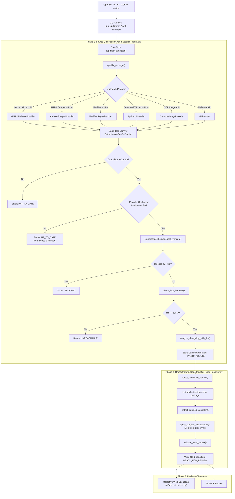
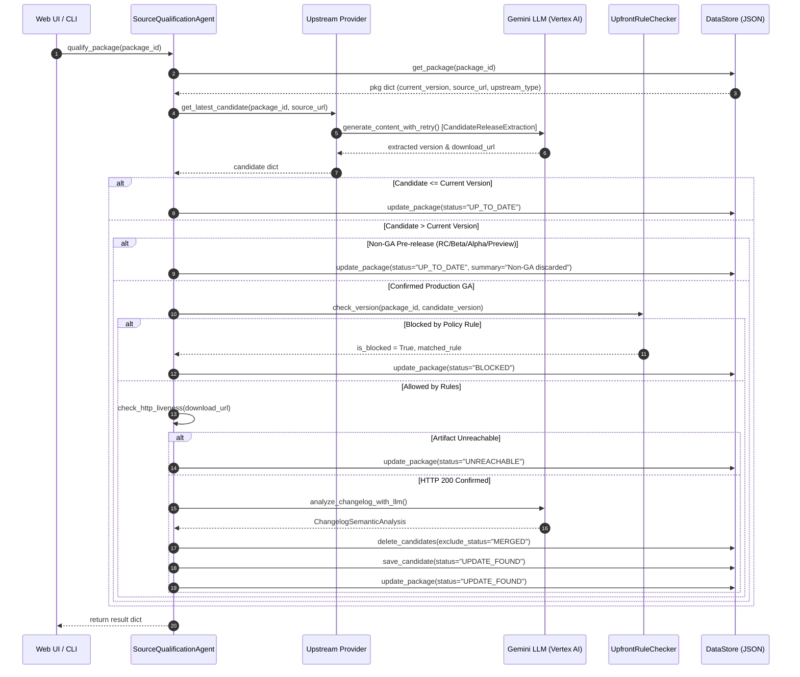
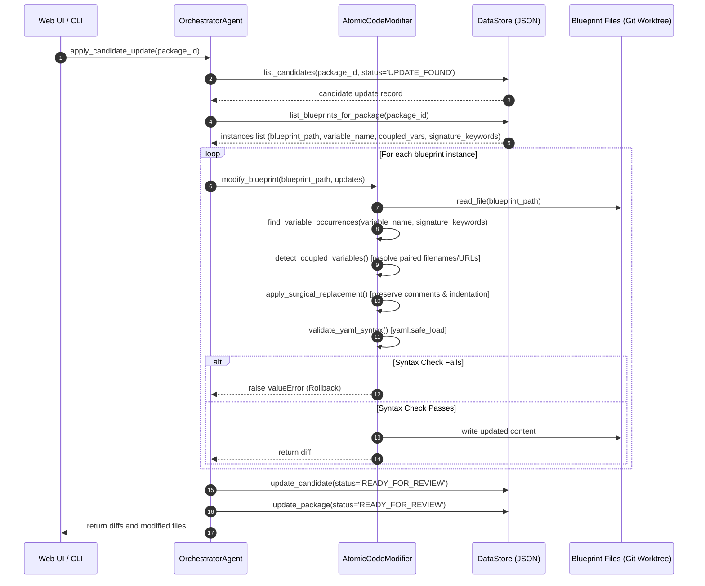

# Cluster Toolkit Automated Dependency Management Pipeline: End-to-End Architecture & Method Reference

**Document Version:** 1.0 (Production Architecture)  
**Location in Repository:** [`tools/infra_updater/`](file:///usr/local/google/home/rahimkh/Desktop/Projects/cluster-toolkit/tools/infra_updater)  
**Primary Artifact:** [`tools/infra_updater/updater_state.json`](file:///usr/local/google/home/rahimkh/Desktop/Projects/cluster-toolkit/tools/infra_updater/updater_state.json)

---

## 1. High-Level Architecture Overview

The Cluster Toolkit Automated Infrastructure Updater is a hybrid **deterministic + LLM agentic pipeline** designed to detect upstream releases, filter out unstable builds, enforce multi-blueprint policy rules, evaluate OS/kernel compatibility, and surgically apply atomic updates to infrastructure blueprints without corrupting comments or YAML formatting.



---

## 2. Directory Layout & Core Files

| File | Purpose |
| :--- | :--- |
| [`datastore.py`](file:///usr/local/google/home/rahimkh/Desktop/Projects/cluster-toolkit/tools/infra_updater/datastore.py) | Thread-safe, atomic transactional JSON datastore managing live package states, candidates, learned rules, and audit logs. |
| [`init_db.py`](file:///usr/local/google/home/rahimkh/Desktop/Projects/cluster-toolkit/tools/infra_updater/init_db.py) | Initializes and seeds [`updater_state.json`](file:///usr/local/google/home/rahimkh/Desktop/Projects/cluster-toolkit/tools/infra_updater/updater_state.json) from canonical package registries, blueprint instances, and dynamic benchmarks. |
| [`source_agent.py`](file:///usr/local/google/home/rahimkh/Desktop/Projects/cluster-toolkit/tools/infra_updater/source_agent.py) | Source Qualification Agent: Upstream release discovery, GA stability reasoning, upfront policy rule gatekeeping, artifact liveness checks, and LLM changelog triage. |
| [`tools/infra_updater/prompts/`](file:///usr/local/google/home/rahimkh/Desktop/Projects/cluster-toolkit/tools/infra_updater/prompts) | Central prompt package importing externalized LLM prompt templates from `tools/infra_updater/prompts/`. |
| [`code_modifier.py`](file:///usr/local/google/home/rahimkh/Desktop/Projects/cluster-toolkit/tools/infra_updater/code_modifier.py) | Atomic Code Modifier: Surgical comment-preserving YAML modification, coupled variable synchronization, signature keyword safety, and YAML AST validation. |
| [`run_updater.py`](file:///usr/local/google/home/rahimkh/Desktop/Projects/cluster-toolkit/tools/infra_updater/run_updater.py) | Master CLI runner with rich colored terminal outputs supporting `--check-all`, `--apply`, `--test-rule-blocking`, `--test-llm-triage`, `--reset`, `--end-to-end`. |
| [`server.py`](file:///usr/local/google/home/rahimkh/Desktop/Projects/cluster-toolkit/tools/infra_updater/server.py) | Python HTTP server hosting the REST API (`/api/state`, `/api/logs`, `/api/diff`, `/api/action`) and serving the visual dashboard. |
| [`ui/app.js`](file:///usr/local/google/home/rahimkh/Desktop/Projects/cluster-toolkit/tools/infra_updater/ui/app.js) | Frontend single-page application handling tab navigation, real-time log streaming, unified status pills, candidate cards, diff review, and blueprint modals. |

---

## 3. End-to-End Flow & Method Directory

### Flow Step 0: State Store Initialization & Seeding

**File:** [`init_db.py`](file:///usr/local/google/home/rahimkh/Desktop/Projects/cluster-toolkit/tools/infra_updater/init_db.py)

#### 1. `init_database(preserve_candidates: bool = False)`
- **When Called:** On system setup, via CLI (`python3 run_updater.py --reset`), or when resetting from the Web UI.
- **What It Does:**
  1. Detects and removes any legacy `updater_state.db` files.
  2. Compiles canonical lists:
     - `packages_data`: 17 registered packages (CUDA x86/ARM64, GVE, MFT, Slurm, NCCL plugins, MPI, DCGM, Spack, Kueue, CMake, Miniforge, etc.).
     - `instances_data`: 43 blueprint occurrences across ML and HPC blueprints with coupled variable specifications and signature keywords.
     - `rules_data`: Policy rule constraints (currently empty `[]` by operator directive).
     - `benchmarks_data`: 6 regression test cases for changelog triage and rule gates.
  3. Builds `seed_json` dictionary.
  4. If `preserve_candidates=True` and [`updater_state.json`](file:///usr/local/google/home/rahimkh/Desktop/Projects/cluster-toolkit/tools/infra_updater/updater_state.json) exists, preserves active candidates.
  5. Atomically writes to [`updater_state.json`](file:///usr/local/google/home/rahimkh/Desktop/Projects/cluster-toolkit/tools/infra_updater/updater_state.json).

#### 2. `preview_tables()`
- **When Called:** Via `python3 run_updater.py --show-tables` or at the end of pipeline runs.
- **What It Does:** Reads data from `DataStore` and prints formatted ASCII tables of packages, blueprint locations, learned rules, and candidate updates.

---

### Flow Step 1: Upstream Discovery & Candidate Qualification

**File:** [`source_agent.py`](file:///usr/local/google/home/rahimkh/Desktop/Projects/cluster-toolkit/tools/infra_updater/source_agent.py)  
**Entry Point:** `SourceQualificationAgent.qualify_package(package_id)` or `SourceQualificationAgent.qualify_all()`



#### Detailed Method Breakdown in `source_agent.py`:

#### 1. `clean_error_message(ex: Any) -> str`
- **Purpose:** Sanitizes raw Python exceptions, Google RPC tracebacks, protobuf message sets, or Vertex AI error JSON dumps into a concise, human-readable 1-line summary (under 95 chars).
- **Cases Handled:**
  - `429 RESOURCE_EXHAUSTED` $\rightarrow$ `"Gemini API rate limit or quota exceeded (429 RESOURCE_EXHAUSTED). Please retry shortly."`
  - `DECODE_PREEMPTED` $\rightarrow$ `"Vertex AI inference preempted by cluster capacity (DECODE_PREEMPTED). Please retry."`
  - `503 UNAVAILABLE` $\rightarrow$ `"Gemini service temporarily unavailable (503 UNAVAILABLE). Please retry shortly."`
  - `401/403 PERMISSION_DENIED` $\rightarrow$ `"Authentication or permission error when contacting Gemini API (401/403)."`
  - `DEADLINE_EXCEEDED` $\rightarrow$ `"Gemini request timed out (DEADLINE_EXCEEDED). Please retry."`
  - Other errors $\rightarrow$ Strips proto URLs `[type.googleapis.com...]` and JSON braces `{...}` to prevent UI layout blowouts.

#### 2. `generate_content_with_retry(client, model, contents, config, max_retries=3, initial_delay=2.0) -> Any`
- **Purpose:** Wraps `client.models.generate_content` with exponential backoff (`2s`, `4s`, `8s`).
- **Behavior:** If a transient 429, 503, or preemption occurs, it logs a warning with the cleaned error message, sleeps, and retries automatically before propagating any failure.

#### 3. `check_http_liveness(url: str) -> bool`
- **Purpose:** Verifies that the upstream candidate installer artifact exists and returns HTTP 200 before advertising an update.
- **Behavior:** Attempts HTTP `HEAD` with redirects followed. If the server returns 403 or 405 (e.g. some CDNs block HEAD requests), falls back to a streaming HTTP `GET` to check status code 200 without downloading the full binary.

#### 4. `parse_semver(v_str: str) -> Optional[Version]`
- **Purpose:** Normalizes raw version tags (e.g., `v13.0.3_580.126.20`, `1:4.7.0-1`, `v1.1.2`) into a `packaging.version.Version` object for mathematical comparison.

#### 5. Upstream Provider Methods:
- **`GitHubReleaseProvider.get_latest_candidate(package_id, source_url)`:**
  1. Extracts `owner/repo` using `extract_repo_from_url()`.
  2. Queries GitHub REST API `/repos/{owner}/{repo}/releases` (falls back to `/tags` if no releases).
  3. Formulates structured prompt with release tags, draft flags, prerelease flags, and assets.
  4. Calls `_extract_with_llm()` with schema `CandidateReleaseExtraction`.
  5. Returns target version, download URL, filename, and release notes.
- **`ArchiveScraperProvider.get_latest_candidate(package_id, source_url)`:**
  1. Fetches official NVIDIA release archive HTML pages (e.g. `cuda-downloads` or `cuda-toolkit-archive`).
  2. Extracts candidate download URLs matching target architecture (`x86_64` vs `arm64-sbsa`).
  3. Calls `_extract_with_llm()` to select the newest production GA standalone `.run` installer.
  4. Validates artifact liveness via `check_http_liveness()`.
- **`ManifestRegexProvider.get_candidate(package_id, manifest_url)`:**
  1. Fetches raw Kubernetes or container YAML manifest from upstream repository.
  2. Calls `_extract_with_llm()` to parse container image tags (e.g., `nccl-plugin-gpudirecttcpx-dev:v3.1.12`).
  3. Returns target version and manifest download URL.
- **`ComputeImageProvider.get_candidate(package_id, current_version, source_url)`:**
  1. Dynamically extracts GCP project and image family from `source_url` or `current_version` (no hardcoded dictionaries).
  2. Executes `gcloud compute images describe-from-family` via subprocess.
  3. Prompts Gemini using `compute_image.txt` from `tools/infra_updater/prompts/` to parse image build, status, and GA qualification.
  4. Returns candidate image version, build date, selfLink, and reasoning.
- **`AptRepoProvider.get_latest_candidate(package_id, source_url, distro, arch)`:**
  1. Dynamically resolves `Packages.gz` URL and repository base without hardcoded distros or architectures.
  2. Parses Debian/Ubuntu package stanzas matching `package_id` or aliases.
  3. Prompts Gemini using `apt_repo.txt` from `tools/infra_updater/prompts/` to pick the latest production GA version string.
  4. Resolves full `.deb` package download URL and SHA256 checksum.
- **`MftProvider.get_latest_candidate(package_id, arch, source_url)`:**
  1. Inherits from `ArchiveScraperProvider` to discover `.tgz` firmware archives directly from official Mellanox download directories.
  2. Falls back to Mellanox downloader API if archive HTML requires dynamic JS.
  3. Resolves latest GA version and tarball download URL for target architecture.

#### 6. `UpfrontRuleChecker.check_version(package_id, candidate_version_str, blueprint_path=None) -> Tuple[bool, Optional[Dict]]`
- **Purpose:** Sub-millisecond policy rule evaluator.
- **Behavior:**
  1. Loads rules from DataStore: `store.list_rules(package_id)`.
  2. Checks rule `action == "BLOCK"`.
  3. Evaluates rule `scope`: if scoped to a specific blueprint, ignores if current blueprint does not match.
  4. Evaluates `version_constraint` using `packaging.specifiers.SpecifierSet` (e.g. `>= 1.5.0, < 1.6.0`).
  5. Returns `(True, rule_dict)` if blocked, or `(False, None)` if allowed.

#### 7. `SourceQualificationAgent.check_http_liveness(url: str) -> bool`
- **Purpose:** Fast, deterministic artifact verification gate executed before invoking expensive LLM changelog triage.
- **Behavior:** Issues an HTTP HEAD request (with GET byte-stream fallback for CDNs returning 403/405/429 on HEAD) to confirm the artifact URL exists and returns HTTP 200.

#### 8. `SourceQualificationAgent.analyze_changelog_with_llm(package_id, version, release_notes) -> ChangelogSemanticAnalysis`
- **Purpose:** Semantic changelog & deprecation triage.
- **Behavior:** Reads raw upstream changelogs in the context of Cluster Toolkit OS targets (Debian 12 Bookworm, Rocky Linux 9, Linux Kernels 6.1/6.6 LTS). Detects dropped kernel versions, removed CLI arguments, and produces an executive summary and PR markdown snippet.

#### 9. `SourceQualificationAgent.qualify_package(package_id) -> Dict[str, Any]`
- **Purpose:** Coordinates the complete qualification pipeline for a single package.
- **Ordered Execution Gates:**
  1. **Status / Snooze Check:** If package is `SNOOZED`, `OBSOLETE`, or `BLOCKED`, skip evaluation.
  2. **Upstream Extraction & GA Stability:** Provider extracts candidate version, ensuring `is_production_ga=True`.
  3. **Version Comparison:** If upstream version $\le$ deployed version, mark `UP_TO_DATE`.
  4. **Policy Rule Check:** Sub-millisecond block rule evaluation.
  5. **Artifact Liveness Verification:** Fast HTTP HEAD check (`check_http_liveness`). If unreachable, marks `UNREACHABLE` immediately without wasting LLM tokens.
  6. **LLM Semantic Changelog Triage:** Gemini evaluates OS/kernel compatibility and breaking deprecations.
  7. **Candidate Update Record:** Saves candidate with status `UPDATE_FOUND`, changelog summary, and extracted SHA256 checksum into DataStore.

---

### Flow Step 2: Atomic Code Modification & Orchestration

**File:** [`code_modifier.py`](file:///usr/local/google/home/rahimkh/Desktop/Projects/cluster-toolkit/tools/infra_updater/code_modifier.py)  
**Entry Point:** `OrchestratorAgent.apply_candidate_update(package_id)`



#### Detailed Method Breakdown in `code_modifier.py`:

#### 1. `AtomicCodeModifier.find_variable_occurrences(content, var_name, keywords=None) -> List[Tuple[int, str]]`
- **Purpose:** Locates lines defining the target variable name in the blueprint file.
- **Safety Mechanism:** Uses `keywords` (signature keywords) to disambiguate generic variable names (e.g. `package_url` or `version`) by ensuring surrounding context lines contain keywords like `["gve", "ethernet"]` or `["gib", "template_vars"]`.

#### 2. `AtomicCodeModifier.detect_coupled_variables(content, primary_var_name, candidate_info, blueprint_path=None) -> List[Dict[str, str]]`
- **Purpose:** Identifies and resolves coupled sibling variables that must change atomically with the primary variable.
- **Example:**
  - When `cuda_installer_url` changes from `.../cuda_13.0.0_580.65.06_linux.run` to `.../cuda_13.3.1_610.43.02_linux.run`:
  - It automatically detects `cuda_installer_file` and generates the updated value `/tmp/cuda_13.3.1_610.43.02_linux.run`.

#### 3. `AtomicCodeModifier.apply_surgical_replacement(content, replacements) -> Tuple[str, List[Dict[str, Any]]]`
- **Purpose:** Replaces values without destroying YAML comments, multiline formatting, or indentations.
- **Mechanism:** Preserves surrounding whitespace, quotes (`"` or `'`), and inline comments (`# ...`).

#### 4. `AtomicCodeModifier.validate_yaml_syntax(content) -> bool`
- **Purpose:** Pre-commit validation gate.
- **Mechanism:** Executes `yaml.safe_load(content)`. If syntax is invalid, raises an exception and aborts before saving the file.

#### 5. `AtomicCodeModifier.modify_blueprint(blueprint_path, updates, dry_run=False) -> Dict[str, Any]`
- **Purpose:** Coordinates the full atomic modification of a single blueprint file.
- **Outputs:** Returns the old value, new value, coupled variable changes, and the exact unified git diff chunk.

#### 6. `OrchestratorAgent.apply_candidate_update(package_id: str) -> Dict[str, Any]`
- **Purpose:** High-level orchestrator for applying updates across all blueprint instances of a package.
- **Lifecycle Transitions:**
  - Transitions candidate update in DataStore: `UPDATE_FOUND` $\rightarrow$ `READY_FOR_REVIEW`.
  - Transitions package status in DataStore: `UPDATE_FOUND` $\rightarrow$ `READY_FOR_REVIEW`.

#### 7. `OrchestratorAgent.revert_update(package_id: Optional[str] = None) -> Dict[str, Any]`
- **Purpose:** Clean workspace rollback.
- **Mechanism:** Identifies all modified blueprint files and runs `git checkout -- <file>` to restore the workspace to `HEAD`.

---

### Flow Step 3: Web Server & Real-Time Dashboard API

**File:** [`server.py`](file:///usr/local/google/home/rahimkh/Desktop/Projects/cluster-toolkit/tools/infra_updater/server.py)

#### 1. `StreamBuffer`
- **Methods:** `write_line()`, `get_all()`, `get_since(offset)`, `clear()`.
- **Purpose:** Thread-safe circular buffer capturing stdout/stderr from CLI sub-processes for real-time browser streaming.

#### 2. `execute_cli_action(cmd_args, action_name)`
- **Purpose:** Spawns a background worker thread executing `python3 run_updater.py <args>`.
- **Behavior:** Streams every log line into `StreamBuffer` and tracks process state (`is_running`, `current_action`, `last_status`).

#### 3. `DashboardHandler (SimpleHTTPRequestHandler)`
- **Endpoints:**
  - `GET /api/state`: Returns package registries, blueprint instances, active candidates, learned rules, benchmarks, audit runs, and git diff statistics.
  - `GET /api/logs?offset=N`: Streams execution log lines starting from index `N`.
  - `GET /api/diff`: Returns the current workspace git diff.
  - `POST /api/action`: Receives `{ action: "check_all" | "apply" | "reset" | "end_to_end", package_id?: string }` and spawns `execute_cli_action()`.

---

### Flow Step 4: Frontend Single-Page App

**File:** [`ui/app.js`](file:///usr/local/google/home/rahimkh/Desktop/Projects/cluster-toolkit/tools/infra_updater/ui/app.js)

#### 1. `fetchState()`
- **Frequency:** Polls every 2000ms (every 1000ms while a background task is running).
- **Behavior:** Updates UI badges, header stats, and invokes modular renderers with isolated `try/catch` blocks.

#### 2. `renderPackages(packages, candidates)`
- **Single Unified Status Badge:** Checks if an active candidate (`UPDATE_FOUND`, `TESTING`, `READY_FOR_REVIEW`) exists for the package; if so, displays that status. Otherwise displays the package's baseline policy status (`REGISTERED`, `UP-TO-DATE`, `BLOCKED`, `ERROR`, `SNOOZED`, `OBSOLETE`).
- **Summary Truncation:** Caps summary text at 95 characters with `...` to preserve table layout, and embeds full details in the cell's `title` attribute for hover inspection.
- **Error Badging:** If status is `ERROR`, adds `<span class="badge badge-red">ERROR</span>`.

#### 3. `renderCandidates(candidates, packages)`
- **Card Rendering:** Renders qualified candidate cards displaying current version $\rightarrow$ target version, GA production badge, Gemini compatibility triage verdict (`COMPATIBLE` vs `POTENTIALLY_BREAKING`), and an action button to **"Review & Apply Update"**.

#### 4. `openBlueprintModal(packageId)`
- **Modal Display:** Opens an interactive modal listing all blueprint files, target variable names, coupled variables, and keyword signatures associated with the selected package.

#### 5. `triggerAction(action, packageId)`
- **Behavior:** Dispatches POST to `/api/action`, opens the live console tab, and initiates log polling.

---

## 4. Comprehensive Cases & Error Handling Matrix

| Scenario / Case | Component Responsible | Method Called | State Transition / Outcome |
| :--- | :--- | :--- | :--- |
| **Case 1: Deployed version matches upstream release** | `SourceQualificationAgent` | `qualify_package()` | `package.status = "UP_TO_DATE"`<br>Summary: *"Deployed blueprint matches latest upstream release."* |
| **Case 2: Deployed version is newer than upstream release** | `SourceQualificationAgent` | `qualify_package()` | `package.status = "UP_TO_DATE"`<br>Summary: *"Upstream version is older than deployed blueprint."* |
| **Case 3: Upstream release is RC, Beta, or Dev Preview** | Upstream Provider (`github_release`, `archive_scraper`, etc.) | `get_latest_candidate()` | `is_production_ga = False`<br>`package.status = "UP_TO_DATE"`<br>Summary: *"Upstream release discarded as non-GA..."* |
| **Case 4: Candidate version matches learned policy rule** | `UpfrontRuleChecker` | `check_version()` | `is_blocked = True`<br>`package.status = "BLOCKED"`<br>Summary: *"Version X blocked by rule Y: Reason..."* |
| **Case 5: Candidate download URL is unreachable (HTTP 404/500)** | `SourceQualificationAgent` | `check_http_liveness()` | `package.status = "UNREACHABLE"`<br>Summary: *"Release download URL unreachable."* |
| **Case 6: Vertex AI rate limit (429 RESOURCE_EXHAUSTED)** | `source_agent.py` | `generate_content_with_retry()` | Retries up to 3 times with backoff (`2s`, `4s`, `8s`). If exhausted, sanitized via `clean_error_message()` $\rightarrow$ `package.status = "ERROR"`. |
| **Case 7: Vertex AI preemption (DECODE_PREEMPTED / 503)** | `source_agent.py` | `generate_content_with_retry()` | Automatically retried. If persistent, logged cleanly as 1-line error. |
| **Case 8: Valid production GA update discovered** | `SourceQualificationAgent` | `qualify_package()` | `candidate.status = "UPDATE_FOUND"`<br>`package.status = "UPDATE_FOUND"`<br>Gemini changelog summary attached. |
| **Case 9: Atomic update with coupled sibling variables** | `AtomicCodeModifier` | `detect_coupled_variables()` | Synchronizes primary variable (e.g. installer URL) and coupled variable (e.g. installer filename) in a single atomic file write. |
| **Case 10: YAML modification creates invalid syntax** | `AtomicCodeModifier` | `validate_yaml_syntax()` | `yaml.safe_load()` fails $\rightarrow$ operation aborted, file write blocked, workspace remains clean. |
| **Case 11: Applying update across multiple blueprints** | `OrchestratorAgent` | `apply_candidate_update()` | Iterates all tracked instances, modifies each YAML file, transitions status to `READY_FOR_REVIEW`. |
| **Case 12: Operator triggers baseline reset** | `OrchestratorAgent` / `init_db.py` | `revert_update()` & `init_database()` | Workspace blueprints reverted to git `HEAD`. Active candidates cleared, packages reset to `REGISTERED`. |

---

## 5. Verification & Testing Reference

```bash
# 1. Run full qualification across all registered packages:
python3 tools/infra_updater/run_updater.py --check-all

# 2. Apply a qualified update to blueprints (e.g. nvidia-cuda-x86):
python3 tools/infra_updater/run_updater.py --apply nvidia-cuda-x86

# 3. Test upfront rule blocking:
python3 tools/infra_updater/run_updater.py --test-rule-blocking

# 4. Test Gemini semantic changelog triage:
python3 tools/infra_updater/run_updater.py --test-llm-triage

# 5. Preview state tables:
python3 tools/infra_updater/run_updater.py --show-tables

# 6. Revert all workspace modifications and reset state store:
python3 tools/infra_updater/run_updater.py --reset
```
