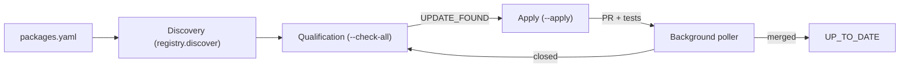

# End-to-End Flow

How a package goes from "pinned in a blueprint" to "merged update". See [README.md](README.md) for
setup and the module map.

```mermaid
flowchart LR
    R["packages.yaml"] --> D["Discovery (registry.discover)"]
    D --> Q["Qualification (--check-all)"]
    Q -->|UPDATE_FOUND| A["Apply (--apply)"]
    A -->|PR + tests| P["Background poller"]
    P -->|merged| U["UP_TO_DATE"]
    P -->|closed| Q
```

## 1. Registry and discovery

- [`packages.yaml`](packages.yaml) declares each package: `upstream` (fetcher type, URL, options),
  optional `test_overrides`, and `pins`. A pin is a regex whose named groups (`version`,
  `major_minor`, `url`, `filename`, `image`) locate the version in blueprint text, optionally limited
  to some paths.
- `registry.discover()` scans `examples/**` and `community/examples/**` of the target clone. Every
  file with a match becomes a blueprint instance embedded in the package document:
  `instance_id` (= `blueprint_path`), `current_version`, `variable_name`, `coupled_vars`, `pin_count`.
- The package's `current_version` is the oldest version across its **selected** blueprints
  (`registry.package_current_version`). Blueprints that disagree are flagged "⚠ out of sync" in the
  UI; applying an update brings them all to the same version.
- Deselected blueprints are stored in `disabled_blueprints` and survive re-discovery.
- `init_db.py` seeds the store from the registry; `--refresh` re-discovers and keeps runtime state.

## 2. Qualification (`run_updater.py --check-all`)

`SourceAgent.qualify_all()` runs `qualify_package()` for every package in parallel
(`qualification.max_workers`):

1. Release an expired snooze; skip `OBSOLETE` packages.
2. **Fetch.** `fetchers.fetch_candidates()` dispatches on `upstream.type` (`github_release`,
   `apt_repository`, `docker_hub`, `archive_scraper`, `raw_manifest`, `mft_api`) and returns
   normalized candidates (version, URL, notes, pre-release flag).
3. **Select.** `selector.prefilter()` keeps non-pre-release versions newer than the current one.
   Gemini picks one with the shared prompt `prompts/select_release.txt` (package-specific rules come
   from `packages.yaml`). If the LLM fails, the newest prefiltered version is used and the candidate
   is tagged "not LLM-verified".
4. **Gates**, in order; the first that fails decides the result:

   | Gate | Fails when | Result |
   | :--- | :--- | :--- |
   | newer | selected version is not newer than current | `UP_TO_DATE` (policy status kept) |
   | GA | the selector marked it non-GA | `UP_TO_DATE` (policy status kept) |
   | policy | package snoozed / blocked for this version | `SNOOZED` / `BLOCKED` |
   | rules | a learned rule blocks the version | `BLOCKED` |
   | open PR | an open PR already tracks this version | unchanged (PR state kept) |
   | live URL | resolved artifact URL does not respond | `UNREACHABLE` |

5. **Record.** Stale `UPDATE_FOUND` candidates are replaced by a new `UPDATE_FOUND` candidate
   (version, download URL, checksum, selection method, release-notes summary).

## 3. Apply (`run_updater.py --apply <package>`)

`CodeModifier.apply_update()`:

1. Pick the newest applicable candidate; re-check the snooze/block policy.
2. Create the branch `prepare_update_branch()` from the latest base (`origin/<base>`; pushed to the
   fork when `repository.is_fork`).
3. For each selected blueprint, `registry.rewrite()` replaces every pin group with values rendered
   from the new version and URL. Images keep their own variant; nested groups inside a replaced
   group are left alone.
4. Validate all rewritten files as YAML before writing any of them (all-or-nothing).
5. Commit, push, and open the PR (body lists every changed variable per blueprint).
6. Candidate and package → `READY_FOR_REVIEW`.
7. **Tests.** `TestManager` maps each changed blueprint to its Cloud Build test from
   `tools/cloud-build/daily-tests/tests/*.yml` (exact path match, plus `test_overrides`), then
   approves the PR's pending builds in parallel. Candidate → `TESTING` with one entry per test.

`--test <package>` re-triggers the tests of an open PR. `--end-to-end` runs check-all and then
applies every candidate.

## 4. Tracking (background poller in `server.py`)

The dashboard server runs a poller every 5 s (skipped while a CLI action runs):

- **PR sync** (`server.pr_sync_interval_seconds`): merged → candidate `MERGED`, package
  `UP_TO_DATE` with the new version in its blueprints; closed without merge → candidate back to
  `UPDATE_FOUND`.
- **Test poll** (`server.test_poll_interval_seconds`): updates each test from Cloud Build. All
  passed → `READY_FOR_REVIEW`; any failed / errored / timed out → `TEST_FAILED`. Tests can run for
  about a day.

All state is in the store, so tracking resumes after a restart. `--sync-prs` runs one PR sync from
the CLI.

## Statuses

Defined once in [`statuses.py`](statuses.py) and served to the UI in `/api/state`.

| Candidate | Meaning |
| :--- | :--- |
| `UPDATE_FOUND` | Qualified, no PR yet |
| `READY_FOR_REVIEW` | PR open; tests passed or none mapped |
| `TESTING` | PR open; tests running |
| `TEST_FAILED` | PR open; at least one test failed |
| `MERGED` | PR merged |
| `SNOOZED` / `BLOCKED` | Held by policy (never overridden automatically, except by a merge) |

A package mirrors its most advanced active candidate (`TESTING` > `TEST_FAILED` >
`READY_FOR_REVIEW` > `UPDATE_FOUND`). Otherwise it is `REGISTERED`, `UP_TO_DATE`, `SNOOZED`,
`BLOCKED`, `UNREACHABLE`, `ERROR` or `OBSOLETE`.

## Dashboard API

| Endpoint | Purpose |
| :--- | :--- |
| `GET /api/state` | Packages (with blueprints), candidates, rules, stats, config, status vocabulary. Sends an ETag; returns 304 if unchanged. |
| `GET /api/logs?run=<id>&offset=<n>` | Output of the running action after the client's cursor (`reset` if the cursor is stale). |
| `GET /api/diff` | Uncommitted diff of the target clone. |
| `POST /api/action` | JSON body `{"action", "package_id", ...}`. |

Actions:

- **Direct** (synchronous): `snooze` (`days`, `version`), `block` (`version`), `unblock`,
  `toggle_blueprint` (`instance_id`, `enabled`), `select_all_blueprints`, `deselect_all_blueprints`.
- **CLI** (one at a time; output streams to `/api/logs`): `check_all`, `apply`, `test`,
  `end_to_end`, `test_rule_blocking`, `reset`. A second CLI action while one runs returns 409.

`POST` requires `Content-Type: application/json`, so cross-origin pages cannot trigger actions.
